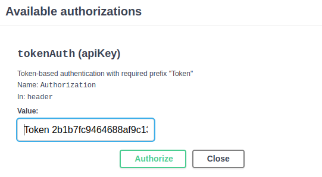

## API Access

*Version added: v0.8.3*

API Keys can be created to access any of TacticalRMM's api endpoints, which will bypass 2fa authentication

When creating the key you'll need to choose a user, which will reflect what permissions the key has based on the user's role.

Navigate to Settings > Global Settings > API Keys to generate a key

Headers:

```json
{
    "Content-Type": "application/json", 
    "X-API-KEY": "J57BXCFDA2WBCXH0XTELBR5KAI69CNCZ"
}
```

Example curl request:

```bash
curl https://api.example.com/clients/ -H "X-API-KEY: Y57BXCFAA9WBCXH0XTEL6R5KAK69CNCZ"
```

## Enable Swagger

This will let you add a browser interface to see how you can use the api better.

Open `/rmm/api/tacticalrmm/tacticalrmm/local_settings.py` and add 

```conf
SWAGGER_ENABLED = True
```

Restart django: `sudo systemctl restart rmm.service`

Then visit `https://api.example.com/api/schema/swagger-ui/` to see it in action.

### Authentication

If you want to use Swagger to query the API, you need to provide an access token. The access token is stored in the
local storage of your browser after logging into `rmm.example.com`.

- Firefox: F12 > Storage tab > expand Local Storage on the left > click on the domain > copy the `access_token`.
- Chrome: F12 > Application tab > expand Local Storage on the left > click on the domain > copy the `access_token`.


In Swagger, click on the lock at the top and paste the access token as `Token 0123456789`.



You can now use the Swagger API to query the backend.

???+ abstract "Example Code"

    === ":fontawesome-brands-python: Python"

        Requests Windows Update check to run against agent ID

        ```python
        import requests

        API = "http://api.example.com"
        HEADERS = {
            "Content-Type": "application/json",
            "X-API-KEY": "DKNRPTHSAPCKT8A36MCAMNZREWWWFPWI",
        }


        def trigger_update_scan():
            agents = requests.get(f"{API}/agents/?detail=false", headers=HEADERS)
            for agent in agents.json():
                r = requests.post(f"{API}/winupdate/{agent['agent_id']}/scan/", headers=HEADERS)
                print(r.json())


        if __name__ == "__main__":
            trigger_update_scan()
        ```

    === ":material-powershell: Powershell"

        ```powershell
        # Example - Get all agents using API

        $headers = @{
            'X-API-KEY' = 'ABC1234567890987654321'
        }

        $url = "https://api.yourdomain.com/agents/"

        $agentsResult = Invoke-RestMethod -Method 'Get' -Uri $url -Headers $headers -ContentType "application/json"

        foreach ($agent in $agentsResult) {
            Write-Host $agent
            
            #Write-Host $agent.hostname
        }
        ```

    === ":material-powershell: Powershell"

        ```powershell
        # Example - Send powershell command to agent.  Make sure to pass {{agent.agent_id}} as a parameter

        param(
            $AgentId
        )

        $headers = @{
            'X-API-KEY' = 'ABC1234567890987654321'
        }

        $url = "https://api.yourdomain.com/agents/$AgentId/cmd/"

        $body = @{
            "shell"   = "powershell"
            "cmd"     = "dir c:\\users" 
            "timeout" = 30
        }


        $commandResult = Invoke-RestMethod -Method 'Post' -Uri $url -Body ($body|ConvertTo-Json) -Headers $headers -ContentType "application/json"

        Write-Host $commandResult
        ```
